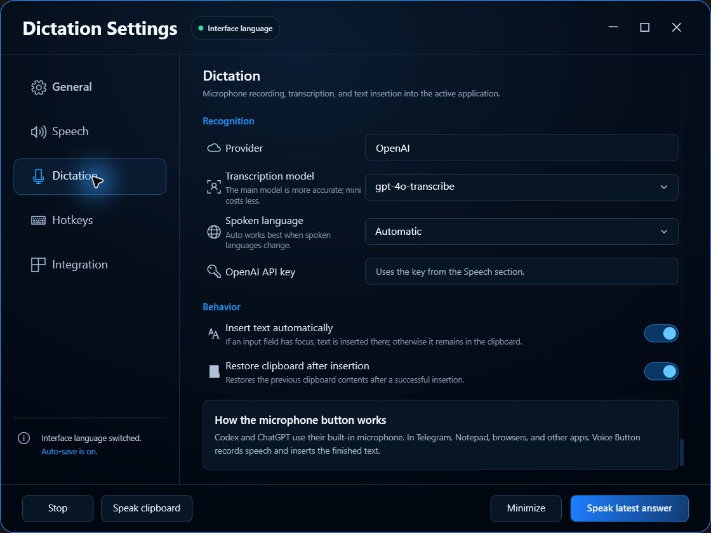

# Voice Button

[](https://github.com/nick-nalivaiko/voice-button/actions/workflows/build.yml)


Voice Button is a compact Windows speech companion. It reads the latest **Codex** or **ChatGPT** answer through the application's own Copy action, converts it to speech with OpenAI TTS, and provides context-aware voice input for supported assistants and other Windows applications.


## Highlights

- **Active-app aware**: uses the built-in microphone in Codex and ChatGPT, and Voice Button dictation everywhere else.
- **Latest answer only**: targets assistant Copy actions instead of reading the user's prompt.
- **OpenAI text-to-speech**: model, voice, and playback speed are configurable.
- **Buffered streaming playback**: starts once ten seconds are buffered (or a shorter clip is complete) and protects a four-second reserve during network slowdowns.
- **Floating controls**: microphone on the left, latest-answer speech on the right, right-click speaker playback for the clipboard, and an expanding player during playback.
- **Real playback controls**: pause/resume, waveform seeking, elapsed time, and stop.
- **Live Codex narration**: an optional corner control follows visible Codex work paragraphs and plays each one through the same seekable player.
- **Universal dictation**: records speech, transcribes it with OpenAI, and inserts it into the focused input field or leaves it in the clipboard.
- **Global hotkeys**: configurable shortcuts for the latest answer, clipboard speech, context-aware microphone action, and sending recorded assistant input with Enter.
- **Clipboard protection**: restores the previous clipboard value when possible.
- **Speech cleanup**: removes or shortens paths, code, links, secrets, hashes, stack traces, tables, structured data, shell commands, and long numeric identifiers.
- **Long-answer support**: sanitizes and chunks long replies before sequential playback.
- **Portable-friendly security**: API keys saved in the UI are stored in Windows Credential Manager, not inside the portable folder.
- **Three interface languages**: English, Ukrainian, and Russian, selected from the Windows UI language on first launch.
- **Tray support**: minimize to tray, optional Windows startup, remembered floating-button position, and local diagnostics.
- **Stable desktop behavior**: only one instance can run per Windows session, and the floating control periodically restores its always-on-top state without taking focus.

## Floating controls

The compact control stays out of the way until playback starts. Left-click the speaker for the latest answer, or right-click it to speak the current clipboard text. During speech it expands into a 274 px player with a 27-segment seekable waveform. Stop collapses the player and reveals a middle waveform button for resumable audio; completed playback returns the control to its two-button state.

| Compact control | Playback control |
| --- | --- |
|  |  |

- **Compact left**: use the built-in microphone in Codex or ChatGPT; start Voice Button dictation in other applications.
- **Compact right**: left-click to speak the latest answer; right-click to speak clipboard text.
- **Saved audio**: the middle waveform appears only when stopped audio can be resumed.
- **Expanded player**: pause or resume on the left, seek through the waveform, and stop on the right.
- **Live corner control**: enable it to queue visible Codex work paragraphs. Pause and seek operate on the current paragraph; stop skips the current live queue and waits for the next paragraph.

## Interface

### Speech and OpenAI

Configure the provider, API key, speech model, voice, speed, and voice preview.


The speech-preparation pipeline can keep useful prose while avoiding content that is unpleasant or unsafe to read aloud.


### Dictation

Choose the OpenAI transcription model and spoken-language hint. Automatic language detection is the default. Voice Button remembers the application and keyboard focus present when recording starts, then sends the completed transcript back to that target.



For standard editable controls, the previous clipboard value can be restored after insertion. For custom editors such as Telegram or Notion, Voice Button also keeps the transcript in the clipboard after the paste attempt, so the text is not lost if the target rejects synthetic input.

Codex and ChatGPT are explicit exceptions: the microphone action keeps using their own built-in dictation and does not send a second transcription request.

### Hotkeys

Click a shortcut field and press the desired key combination. Changes are registered globally and saved automatically.

The fourth action sends the current built-in Codex or ChatGPT voice input by delivering Enter to the active assistant window.


### Codex and ChatGPT integration

Tune window detection, Copy discovery, clipboard restoration, microphone retry behavior, optional live Codex work narration, and diagnostics.


## Requirements

- Windows 10 or Windows 11, x64
- An OpenAI API key with access to the Speech API
- Internet access for OpenAI TTS requests
- .NET 8 SDK for building from source

A self-contained portable build includes the .NET runtime and does not require a separate .NET installation.

## Download

Get the current Windows release from [GitHub Releases](https://github.com/nick-nalivaiko/voice-button/releases/latest):

- **Installer**: recommended for a normal per-user Windows installation with Start menu and uninstall support.
- **Portable ZIP**: extract anywhere and run without installation or a separate .NET runtime.

Neither release package contains an OpenAI API key. Enter your own key in **Speech** after the first launch.

## Build and run

```powershell
git clone https://github.com/nick-nalivaiko/voice-button.git
cd VoiceButton

dotnet restore VoiceButton.sln
dotnet build VoiceButton.sln -c Release
dotnet run --project src/VoiceButton/VoiceButton.csproj
```

The default hotkey is `Ctrl+Alt+V`.

## Create a portable build

```powershell
dotnet publish src/VoiceButton/VoiceButton.csproj `
  -c Release `
  -r win-x64 `
  --self-contained true `
  -o artifacts/VoiceButton-portable `
  -p:PublishSingleFile=true `
  -p:IncludeNativeLibrariesForSelfExtract=true `
  -p:PublishTrimmed=false
```

Create an empty `portable.mode` file next to the published executable to keep settings and diagnostics under the local `data` directory.

The portable folder must not contain your `.env` file. Enter the API key in **Speech**, and Voice Button will store it in Windows Credential Manager for the current Windows user. A copy moved to another computer will require that computer's own key.

## API key security

The recommended setup is:

1. Open **Speech**.
2. Paste the OpenAI API key.
3. Select **Save**.
4. Use **Check** to validate it.

Keys saved from the app are stored as a generic Windows credential named `VoiceButton/OpenAI API Key`. The repository ignores `.env`, `.env.local`, build output, portable packages, and local diagnostic files.

For local development only, `.env.example` can be copied to `.env`; never commit the resulting file.

The repository includes layered leak prevention:

- `scripts/check-secrets.ps1` scans tracked files, staged changes, or the complete reachable Git history without printing secret values.
- `.githooks/pre-commit` blocks suspicious staged content locally.
- GitHub Actions scans the complete history on every push and pull request.
- `scripts/build-release.ps1` refuses to package a release unless the history scan passes and the portable inventory contains exactly the expected three files.

Enable the local hook in a fresh clone with:

```powershell
git config core.hooksPath .githooks
```

## How it works

1. Voice Button identifies the active supported application.
2. Windows UI Automation locates the latest assistant Copy action.
3. The copied text is read from the clipboard and the previous clipboard value is restored when possible.
4. Speech filters remove or shorten content that should not be spoken.
5. Long text is split into safe chunks and sent to OpenAI TTS.
6. Each MP3 response begins playing from a ten-second buffer, or as soon as a shorter clip is complete, while the remaining audio continues to arrive.
7. Audio is played in order through the floating seekable player, with automatic rebuffering when needed.

When live Codex narration is enabled globally, Voice Button watches the visible accessibility tree for the current Codex work block. The corner control starts or stops automatic narration. Stable paragraphs are queued in order, sanitized by the same speech filters, and played one at a time through the existing player. Pausing preserves the exact position and pending paragraphs; stopping discards the current live queue while leaving the mode ready for the next new paragraph.

The primary answer-reading path does not use screenshots or OCR.

For dictation, Voice Button captures 16 kHz mono audio locally, sends the completed WAV recording to the selected OpenAI transcription model, restores the original target application, and sends Ctrl+V when keyboard focus still belongs to that target. The transcript remains available in the clipboard whenever insertion cannot be verified.

## Known limitations

- Codex or ChatGPT UI updates can require selector adjustments.
- Copy controls that only appear on hover depend on the hover-reveal fallback.
- The target application must expose enough information through Windows UI Automation.
- Live narration can read only work text that Codex exposes through Windows accessibility; hidden internal reasoning is not available.
- Elevated, protected, or accessibility-limited applications can reject synthetic paste input; clipboard fallback remains available.
- OpenAI API usage is billed by OpenAI according to the account attached to the API key.

## Repository structure

```text
Assets/                         Application icon
docs/screenshots/               Public interface screenshots
src/VoiceButton/                WPF application source
VoiceButton.sln                 Visual Studio solution
.env.example                    Local development template
```

## Status

Voice Button is a working Windows utility with Codex and ChatGPT answer playback, live visible Codex work narration, context-aware built-in microphone control, universal dictation, configurable hotkeys, a floating seekable player, speech cleanup, tray behavior, diagnostics, and portable settings.
