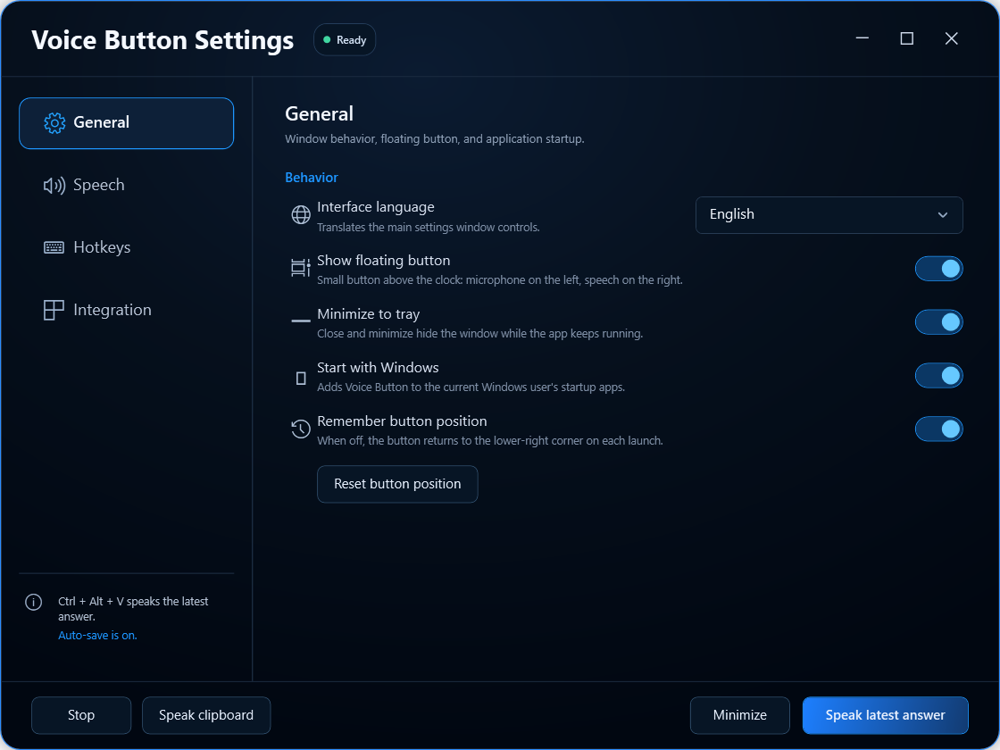
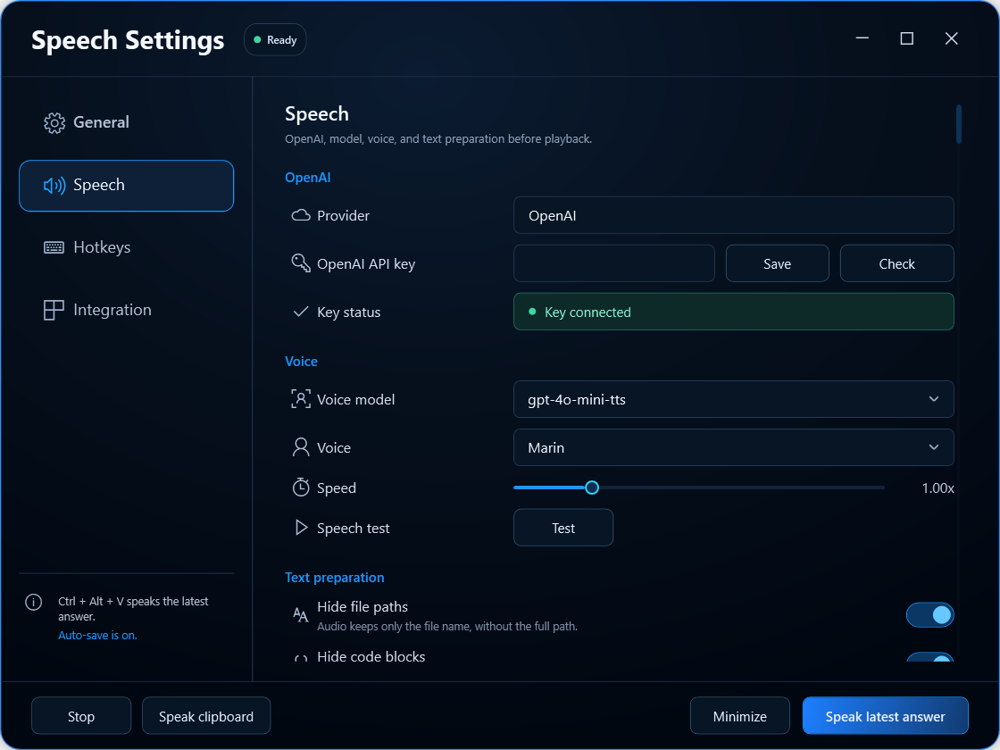
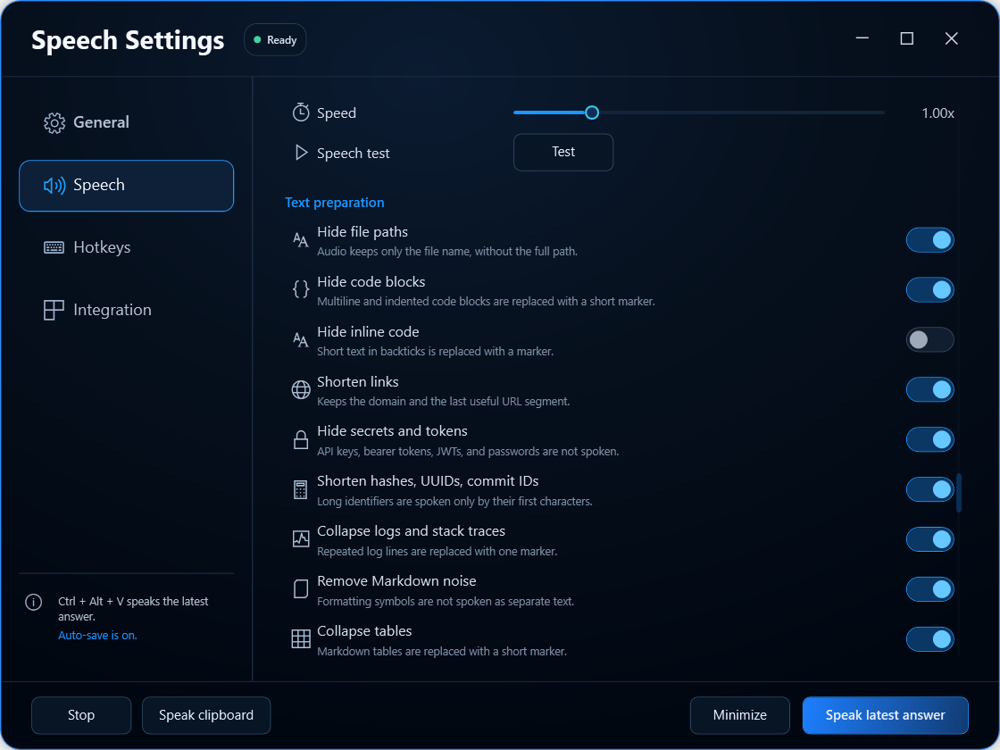
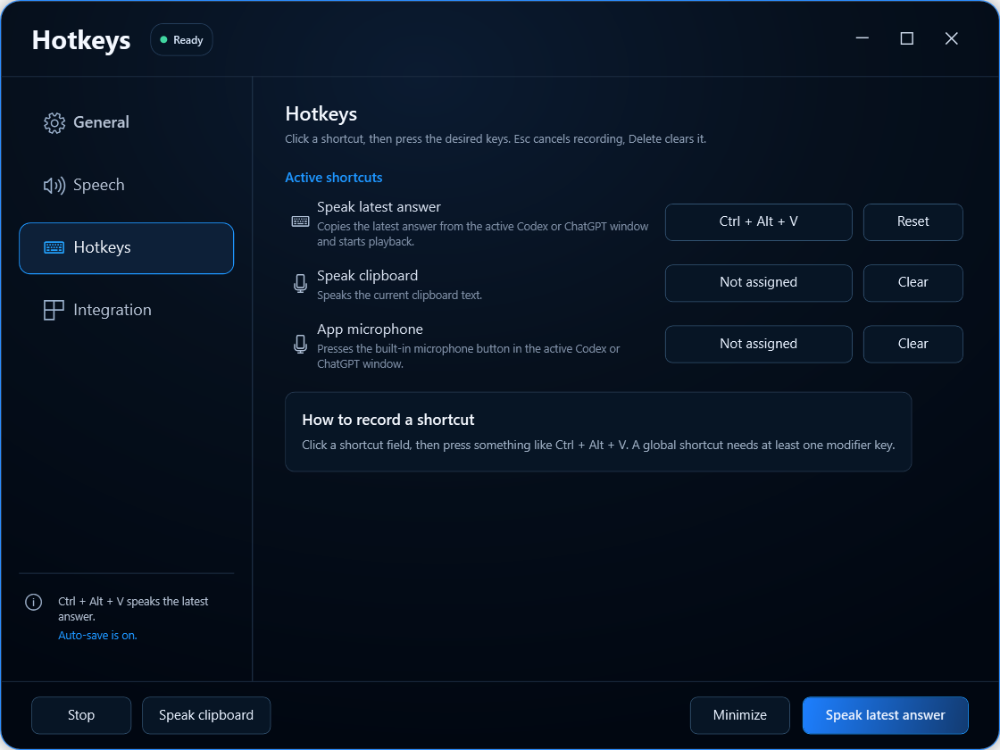
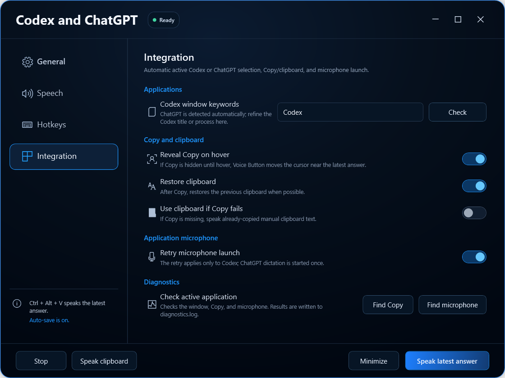

# Voice Button

[](https://github.com/nick-nalivaiko/VoiceButton/actions/workflows/build.yml)


Voice Button is a compact Windows companion for **Codex** and **ChatGPT**. It copies the latest assistant answer through the application's own Copy action, converts it to speech with OpenAI TTS, and gives you a floating control for speech playback and built-in dictation.



## Highlights

- **Active-app aware**: works with the active Codex or ChatGPT window.
- **Latest answer only**: targets assistant Copy actions instead of reading the user's prompt.
- **OpenAI text-to-speech**: model, voice, and playback speed are configurable.
- **Buffered streaming playback**: starts once ten seconds are buffered (or a shorter clip is complete) and protects a four-second reserve during network slowdowns.
- **Floating controls**: microphone on the left, speech on the right, and an expanding player during playback.
- **Real playback controls**: pause/resume, waveform seeking, elapsed time, and stop.
- **Global hotkeys**: configurable shortcuts for the latest answer, clipboard speech, and application microphone.
- **Clipboard protection**: restores the previous clipboard value when possible.
- **Speech cleanup**: removes or shortens paths, code, links, secrets, hashes, stack traces, tables, structured data, shell commands, and long numeric identifiers.
- **Long-answer support**: sanitizes and chunks long replies before sequential playback.
- **Portable-friendly security**: API keys saved in the UI are stored in Windows Credential Manager, not inside the portable folder.
- **Three interface languages**: English, Ukrainian, and Russian.
- **Tray support**: minimize to tray, optional Windows startup, remembered floating-button position, and local diagnostics.

## Floating controls

The compact control stays out of the way until playback starts. During speech it expands into a 274 px player with a 27-segment seekable waveform.

| Compact control | Playback control |
| --- | --- |
|  |  |

- **Left**: start dictation when idle; pause or resume during playback.
- **Center**: start speech when idle; click or drag the waveform to seek during playback.
- **Right**: stop the current playback.

## Interface

### Speech and OpenAI

Configure the provider, API key, speech model, voice, speed, and voice preview.



The speech-preparation pipeline can keep useful prose while avoiding content that is unpleasant or unsafe to read aloud.



### Hotkeys

Click a shortcut field and press the desired key combination. Changes are registered globally and saved automatically.



### Codex and ChatGPT integration

Tune window detection, Copy discovery, clipboard restoration, microphone retry behavior, and diagnostics.



## Requirements

- Windows 10 or Windows 11, x64
- An OpenAI API key with access to the Speech API
- Internet access for OpenAI TTS requests
- .NET 8 SDK for building from source

A self-contained portable build includes the .NET runtime and does not require a separate .NET installation.

## Download

Get the current Windows release from [GitHub Releases](https://github.com/nick-nalivaiko/VoiceButton/releases/latest):

- **Installer**: recommended for a normal per-user Windows installation with Start menu and uninstall support.
- **Portable ZIP**: extract anywhere and run without installation or a separate .NET runtime.

Neither release package contains an OpenAI API key. Enter your own key in **Speech** after the first launch.

## Build and run

```powershell
git clone https://github.com/nick-nalivaiko/VoiceButton.git
cd VoiceButton

dotnet restore VoiceButton.sln
dotnet build VoiceButton.sln -c Release
dotnet run --project src/VoiceButton/VoiceButton.csproj
```

The default hotkey is `Ctrl+Alt+V`.

## Create a portable build

```powershell
dotnet publish src/VoiceButton/VoiceButton.csproj `
  -c Release `
  -r win-x64 `
  --self-contained true `
  -o artifacts/VoiceButton-portable `
  -p:PublishSingleFile=true `
  -p:IncludeNativeLibrariesForSelfExtract=true `
  -p:PublishTrimmed=false
```

Create an empty `portable.mode` file next to the published executable to keep settings and diagnostics under the local `data` directory.

The portable folder must not contain your `.env` file. Enter the API key in **Speech**, and Voice Button will store it in Windows Credential Manager for the current Windows user. A copy moved to another computer will require that computer's own key.

## API key security

The recommended setup is:

1. Open **Speech**.
2. Paste the OpenAI API key.
3. Select **Save**.
4. Use **Check** to validate it.

Keys saved from the app are stored as a generic Windows credential named `VoiceButton/OpenAI API Key`. The repository ignores `.env`, `.env.local`, build output, portable packages, and local diagnostic files.

For local development only, `.env.example` can be copied to `.env`; never commit the resulting file.

## How it works

1. Voice Button identifies the active supported application.
2. Windows UI Automation locates the latest assistant Copy action.
3. The copied text is read from the clipboard and the previous clipboard value is restored when possible.
4. Speech filters remove or shorten content that should not be spoken.
5. Long text is split into safe chunks and sent to OpenAI TTS.
6. Each MP3 response begins playing from a ten-second buffer, or as soon as a shorter clip is complete, while the remaining audio continues to arrive.
7. Audio is played in order through the floating seekable player, with automatic rebuffering when needed.

The primary path does not use screenshots or OCR.

## Known limitations

- Codex or ChatGPT UI updates can require selector adjustments.
- Copy controls that only appear on hover depend on the hover-reveal fallback.
- The target application must expose enough information through Windows UI Automation.
- OpenAI API usage is billed by OpenAI according to the account attached to the API key.

## Repository structure

```text
Assets/                         Application icon
docs/screenshots/               Public interface screenshots
src/VoiceButton/                WPF application source
VoiceButton.sln                 Visual Studio solution
.env.example                    Local development template
```

## Status

Voice Button is a working MVP for Windows. The current build supports Codex and ChatGPT answer playback, application dictation, configurable hotkeys, a floating seekable player, speech cleanup, tray behavior, diagnostics, and portable settings.
